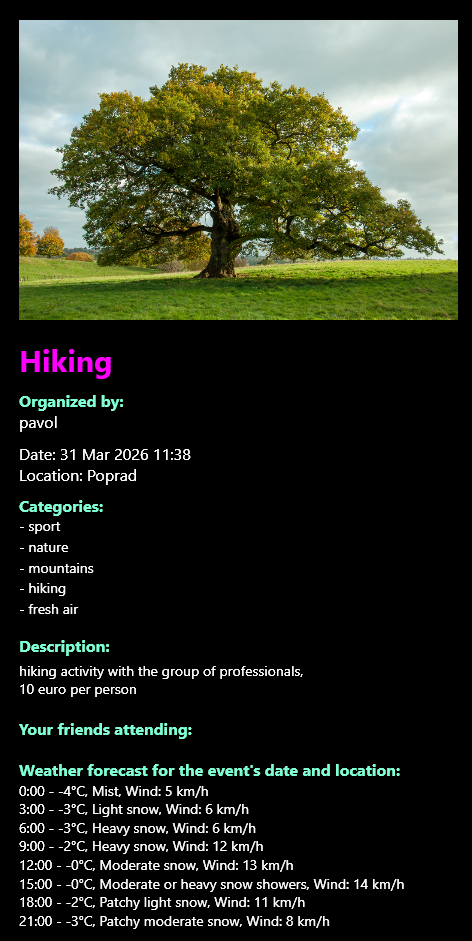
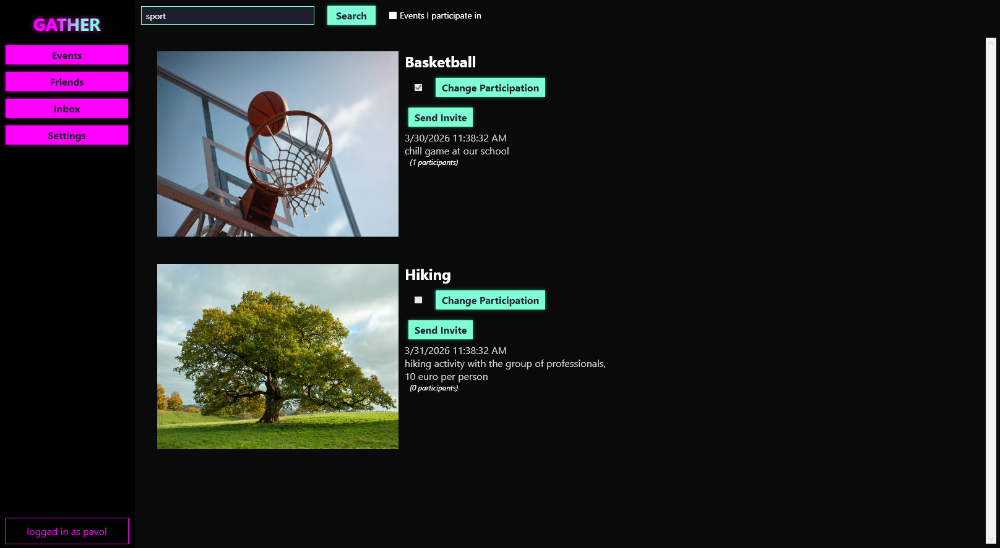
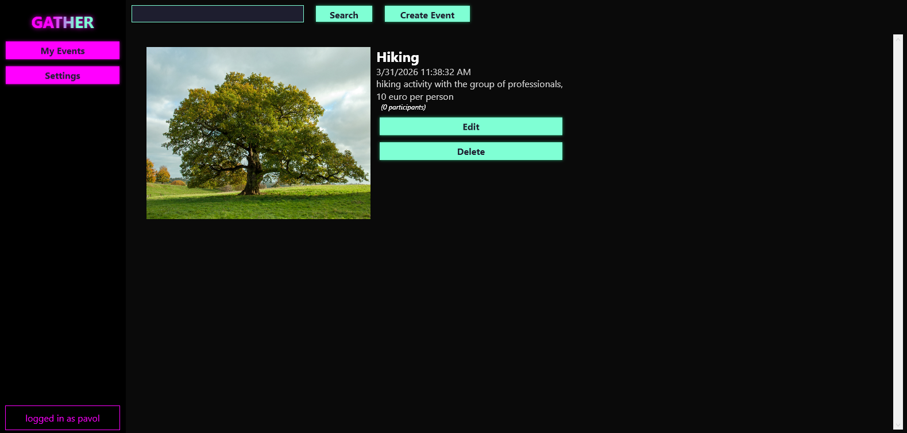
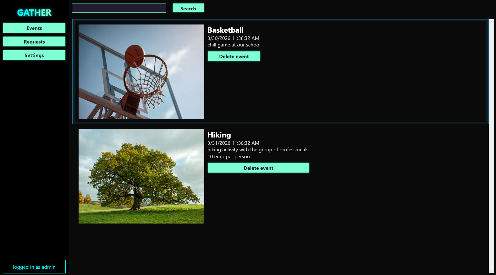

# 🌟 Gather - Social App for Events

Gather is a social application designed to help users discover, join, and organize events. Users can explore various events, filter them by category, and connect with friends. Organizers can create and manage events, while admins oversee user and event verification.

---

## Technical Stack
- **Framework:** .NET 8, WPF
- **Architecture:** MVVM (Model-View-ViewModel)
- **Dependency Injection:** Microsoft.Extensions.DependencyInjection
- **Database:** Entity Framework Core (MSSQL Server)
- **API:** Weather API integration for real-time updates

---

## Prerequisites
- Windows 10/11 (WPF requires Windows)
- Visual Studio 2022
- .NET 8 SDK

---

## Project Structure
- **Config/** – Contains static configuration and application settings (e.g., Connection Strings).
- **Data/** – Houses the Entity Framework AppDbContext and data seeding logic.
- **Managers/** – Business logic layer between Data and ViewModels.
- **Models/** – Defines the core data structures and Entity Framework entities (User, Event, etc.).
- **Services/** – Contains modular infrastructure logic (Windows, Navigation, Dialogs, Identity, ...) injected into ViewModels via Dependency Injection.
- **ViewModels/** – ViewModels using ObservableObject and RelayCommand.
- **Views/** – The XAML-based user interface.
- **WeatherAPI/** – Dedicated module for integration with external meteorological services.

---

## Getting Started

1. Clone the repository:
```bash
git clone https://github.com/k4dlec4y/Gather.git
```
2. Open in Visual Studio 2022
3. Configure connection string in `Config/Configuration.cs` to point to your local MSSQL Server instance
4. Ensure SQL Server is running locally and accessible.
5. Open Package Manager Console and run `Update-Database` to create the database schema and seed initial data.
6. Start the application

---

## App Showcase

A few screenshots of the application:

| **Event Details** | **User Dashboard** |
|:---:|:---:|
|  |  |
| *Detailed event info.* | *Standard user view.* |

| **Organizer Management** | **Admin Control Panel** |
|:---:|:---:|
|  |  |
| *Event Organizer view.* | *Admin view.* |

---

## Features

### Authentication
- **User Registration & Deletion**  
  Users can create an account or permanently delete their profile.
- **Login & Logout**  
  Secure authentication for users, organizers, and admins.

### User Roles

#### Regular User
- **Browse Events**  
  View a list of available events.
- **Filter Events by Category**  
  Narrow down events based on interests.
- **RSVP to Events**  
  Mark attendance for events.
- **Friends System**  
  - Add friends to your network.  
  - Receive event invitations from friends.  
  - See which friends are attending an event.

#### Event Organizer
- **Create Events**  
  Set up new events with details like location, date, and category.
- **Modify or Cancel Events**  
  Edit event details or remove events entirely.

#### Admin
- **User & Event Verification**  
  Approve and monitor organizers and events.
- **Admin Credentials** (for testing)  
  - Username: `admin`  
  - Password: `a`  

### Weather Integration
- **Automatic Weather Fetching**  
  - Weather data is fetched asynchronously from an API.
  - Uses `wttr.in` (no API key required)
  - Only displayed if the event occurs within **2 days or less**.  
  - Location-based weather estimation (based on organizer input).  
  - If location is unrecognized, weather is not displayed.

---

## License
This project is licensed under the MIT License - see the [LICENSE](LICENSE) file for details.
